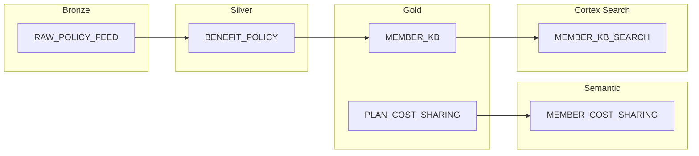
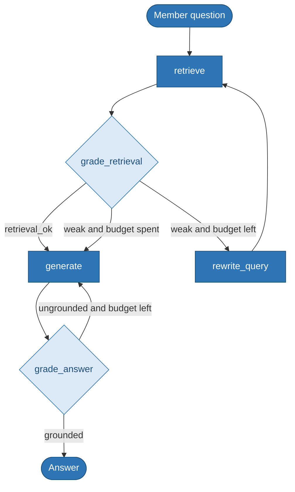
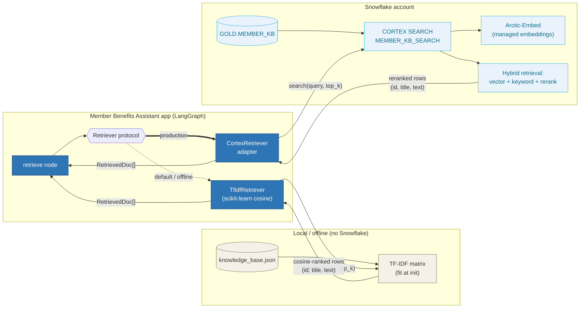
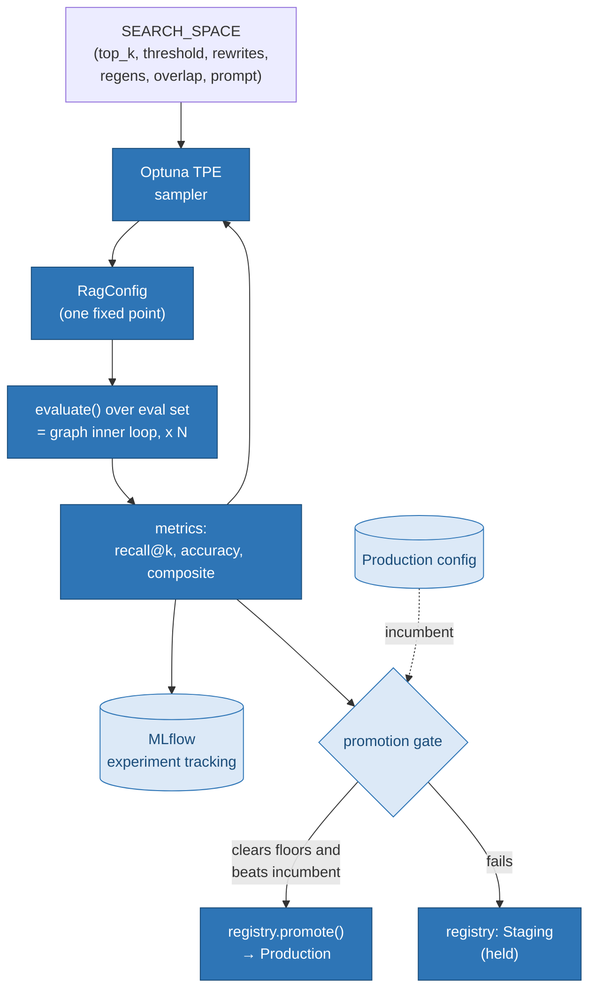

# Member Benefits Assistant — Agentic RAG on LangGraph with Snowflake Cortex + MLOps

A production-shaped portfolio project for **agentic AI engineering on
Snowflake**: medallion-architecture semantic data assets (bronze → silver →
gold), **Cortex Search** for hybrid retrieval, **semantic views** for trusted
analytics, and a **LangGraph** member-navigation agent with a full **MLOps
lifecycle** (MLflow, Optuna HPO, promotion gate, PSI drift monitoring).

The domain is **health-plan member benefits navigation** (coverage, copays,
prior auth, telehealth, pharmacy) using **synthetic data only** — no real PHI.

> **For role alignment:** see
> [docs/agentic-ai-engineering-primer.md](docs/agentic-ai-engineering-primer.md)
> for a Cambia Health Solutions Agentic AI Engineer requirements matrix.

```
14 passed in tests/  •  TF-IDF default retriever  •  Cortex Search production adapter
```

---

## Why this exists

Two things separate this from a "RAG demo":

1. **The graph has cycles.** A plain LCEL chain is a DAG — prompt in, answer out.
   This graph **self‑corrects**: if retrieval is weak it rewrites the query and
   retrieves again; if the answer isn't grounded it regenerates. The loops are
   bounded by hyperparameters and the control flow is decided by graded state —
   exactly what a linear chain cannot express.

2. **The hyperparameters are searched, not guessed.** Retrieval `top_k`, the
   relevance threshold that triggers the rewrite loop, the loop budgets, and the
   prompt version are all tuned by an Optuna **TPE** sweep. The inner loop is the
   graph executing at a _fixed_ config; the outer loop searches the config space
   — and every trial is tracked, gated, and (if it wins) promoted.

---

## Snowflake medallion + semantic layer



DDL ships in `snowflake/` (deploy in order — see
[snowflake/README.md](snowflake/README.md)):

| Script                  | Layer                               |
| ----------------------- | ----------------------------------- |
| `01_bronze.sql`         | Raw policy feeds                    |
| `02_silver.sql`         | Cleansed `BENEFIT_POLICY`           |
| `03_gold.sql`           | `MEMBER_KB` + `PLAN_COST_SHARING`   |
| `04_semantic_views.sql` | Semantic views for copay analytics  |
| `05_cortex_search.sql`  | `MEMBER_KB_SEARCH` hybrid search    |
| `06_governance.sql`     | Roles, masking, row access policies |

---

## The agentic‑RAG workflow



A real trace (offline mock), showing a clean single pass:

```
Q: Do I need prior authorization for an MRI?
   . retrieve(query='Do I need prior authorization for an MRI?') -> 3 docs, top_score=0.241
   . grade_retrieval -> ok=True (score=0.241 thr=0.1, overlap=0.667 min=0.04)
   . generate -> 195 chars
   . grade_answer -> ok=True (grounded=True, fallback=False)
A: Certain services require prior authorization before care is rendered. These include ...
```

---

## How Snowflake Cortex cooperates

Retrieval sits behind a `Retriever` protocol, so the graph is agnostic to the
backend. The default `TfidfRetriever` runs locally; the `CortexRetriever`
swaps in Snowflake's managed **Cortex Search** — hybrid vector + keyword search

### with semantic reranking — without changing a line of graph code.



Provision Cortex Search (full pipeline in `snowflake/05_cortex_search.sql`):

```sql
CREATE OR REPLACE CORTEX SEARCH SERVICE AI.MEMBER_NAV.MEMBER_KB_SEARCH
    ON text
    ATTRIBUTES id, title, category
    WAREHOUSE = COMPUTE_WH
    TARGET_LAG = '1 hour'
    EMBEDDING_MODEL = 'snowflake-arctic-embed-l-v2.0'
    AS (SELECT id, title, category, text FROM AI.GOLD.MEMBER_KB WHERE is_active = TRUE);
```

then point the graph at it:

```python
from snowflake.snowpark import Session
from member_nav import CortexRetriever, build_graph, RagConfig

session = Session.builder.configs(conn_params).create()
retriever = CortexRetriever(session, service_name="MEMBER_KB_SEARCH")
app = build_graph(RagConfig(), retriever)   # same graph, managed retrieval
```

> Runs end‑to‑end with **zero credentials**. When `ANTHROPIC_API_KEY` is unset,
> the reasoning nodes use a deterministic offline mock, so tests, the eval gate,
> and the HPO sweep all execute offline and reproducibly. Set the key to route
> the same graph through Claude.

---

## State, nodes, and durable persistence

LangGraph state is a typed `TypedDict` whose fields carry **reducers** that
define how each node's updates merge. Getting reducers right is the single most
common source of LangGraph production incidents, so they're explicit here:
`retrieved` accumulates across rewrite iterations (`operator.add`), while scalar
fields overwrite (last‑write‑wins).

Every run is checkpointed through a **SqliteSaver**, so a thread can pause and
resume and its full state history is recoverable from disk.

---

## The MLOps + HPO lifecycle



After the sweep, the best config is **registered** (Staging) and run through the
**promotion gate**: it must clear absolute floors (recall ≥ 0.75, accuracy ≥
0.50) _and_ beat the incumbent's composite before it's promoted to Production.

### Production monitoring (drift)

Retrieval top‑score distributions are monitored with **Population Stability
Index** (PSI):

```
PSI bands: <0.10 stable | 0.10-0.25 moderate | >0.25 significant
```

---

## Quickstart

```bash
# 1. install
pip install -r requirements.txt        # or: pip install -e ".[dev]"

# 2. (optional) route reasoning through Claude instead of the offline mock
cp .env.example .env && echo "ANTHROPIC_API_KEY=sk-ant-..." >> .env

# 3. see the agentic graph (traces + durable checkpointing)
python scripts/demo.py

# 4. tune hyperparameters: 20-trial TPE sweep, tracked + gated + promoted
python scripts/run_sweep.py 20

# 5. evaluate the current Production config
python scripts/run_eval.py

# 6. simulate retrieval drift and watch PSI flag it
python scripts/run_monitoring.py

# 7. inspect every trial
mlflow ui --backend-store-uri sqlite:///mlflow.db

# tests (fully offline)
pytest -q
```

---

## Project structure

```
snowflake/               Medallion DDL, semantic views, Cortex, governance
docs/                    agentic-ai-engineering-primer.md (role alignment)
src/member_nav/
├── config.py            RagConfig dataclass + SEARCH_SPACE (the tunable surface)
├── llm.py               Claude client w/ deterministic offline mock fallback
├── knowledge.py         Retriever protocol + TfidfRetriever + CortexRetriever
├── state.py             Typed LangGraph state with explicit reducers
├── graph.py             The agentic-RAG graph (cyclic, conditional edges)
└── mlops/
    ├── tracking.py      MLflow experiment tracking (SQLite backend)
    ├── evaluation.py    recall@k / accuracy / composite + promotion gate
    ├── monitoring.py    PSI drift detection
    ├── registry.py      Versioned config registry w/ stage promotion
    └── tuning.py        Optuna TPE sweep → tracking → gate → registry

scripts/   demo.py · run_sweep.py · run_eval.py · run_monitoring.py
data/      knowledge_base.json (synthetic member KB) · eval_set.json (ground truth)
tests/     test_pipeline.py (14 tests, offline)
```

---

## Design notes

- **Medallion → Cortex → agent.** Bronze/silver/gold SQL feeds gold `MEMBER_KB`;
  Cortex Search indexes it; the LangGraph agent consumes via `CortexRetriever`.
- **Backend‑neutral retrieval.** TF‑IDF ↔ Cortex Search are one-line swaps.
- **Offline‑first.** Deterministic mock LLM keeps CI reproducible without API keys.
- **Gated promotion.** No config reaches Production without clearing metric floors.
- **Governed access.** Illustrative roles, masking, and row policies in `06_governance.sql`.

---

### Production swaps

| Concern          | This repo (runs anywhere) | Production path                     |
| ---------------- | ------------------------- | ----------------------------------- |
| Retrieval        | TF‑IDF cosine             | Snowflake Cortex Search             |
| Reasoning LLM    | Offline mock / Claude     | Claude via `ANTHROPIC_API_KEY`      |
| Experiment store | Local SQLite MLflow       | MLflow Tracking Server / Databricks |
| Checkpointer     | SqliteSaver               | Postgres checkpointer               |
| Drift monitoring | Offline PSI script        | Scheduled job → alerting            |

---

_Built by Shawn Becker · Spexture (Independent Consulting) · Portfolio reference
for agentic AI engineering on Snowflake. Synthetic health-plan data only; the
LangGraph control flow, medallion semantic assets, Cortex integration, HPO loop,
and promotion gate are the transferable core._
