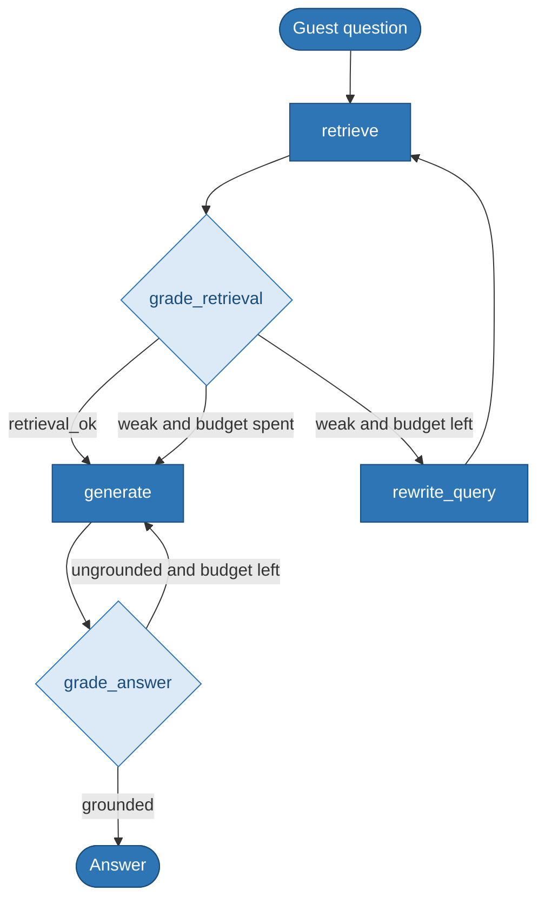
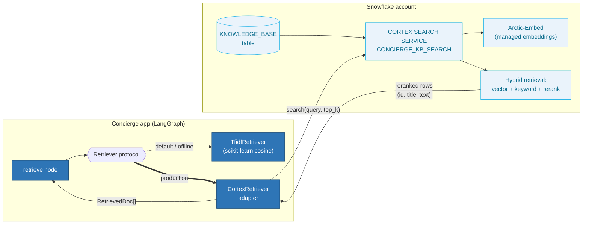
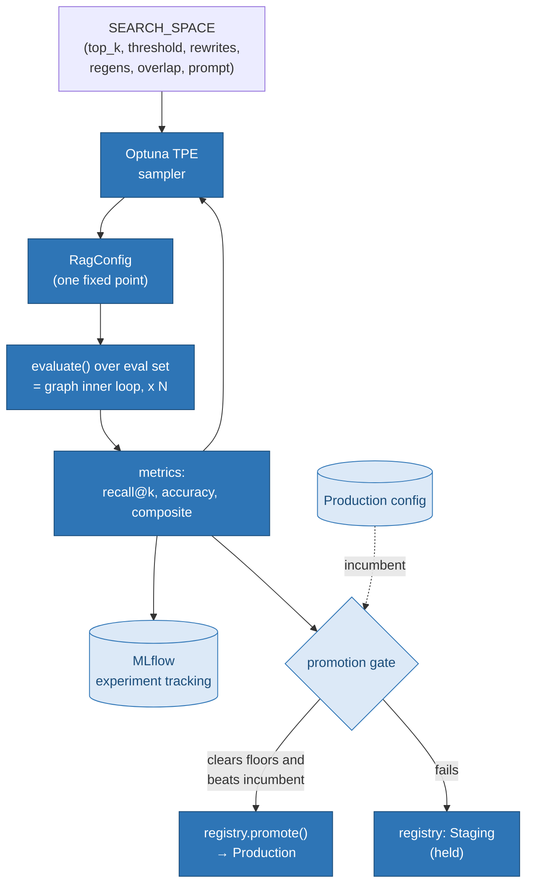

# Concierge — Agentic RAG on LangGraph with an MLOps + HPO Lifecycle

A production-shaped reference implementation of an **agentic retrieval‑augmented
generation** system for a hospitality concierge, built on **LangGraph**, wrapped
in a full **MLOps lifecycle**: experiment tracking (MLflow), hyperparameter
optimization (Optuna TPE), an evaluation/promotion gate, a versioned config
registry, and production drift monitoring (PSI).

The retrieval layer is pluggable: a local TF‑IDF retriever (default, runs
anywhere) and a **Snowflake Cortex Search** adapter for the managed,
hybrid‑search production path.

> Runs end‑to‑end with **zero credentials**. When `ANTHROPIC_API_KEY` is unset,
> the reasoning nodes use a deterministic offline mock, so tests, the eval gate,
> and the HPO sweep all execute offline and reproducibly. Set the key to route
> the same graph through Claude.

```
14 passed in tests/  •  TF-IDF default retriever  •  Cortex Search production adapter
```

---

## Why this exists

Two things separate this from a "RAG demo":

1. **The graph has cycles.** A plain LCEL chain is a DAG — prompt in, answer out.
   This graph **self‑corrects**: if retrieval is weak it rewrites the query and
   retrieves again; if the answer isn't grounded it regenerates. The loops are
   bounded by hyperparameters and the control flow is decided by graded state —
   exactly what a linear chain cannot express.

2. **The hyperparameters are searched, not guessed.** Retrieval `top_k`, the
   relevance threshold that triggers the rewrite loop, the loop budgets, and the
   prompt version are all tuned by an Optuna **TPE** sweep. The inner loop is the
   graph executing at a *fixed* config; the outer loop searches the config space
   — and every trial is tracked, gated, and (if it wins) promoted.

---

## The agentic‑RAG workflow



**The two cycles are the point.** `rewrite_query → retrieve` is the retrieval
self‑correction loop; `grade_answer → generate` is the regeneration loop. Each is
capped by a hyperparameter (`max_rewrites`, `max_regenerations`) so the agent
can iterate without ever looping forever.

A real trace (offline mock), showing a clean single pass:

```
Q: Are dogs allowed and is there a fee?
   . retrieve(query='Are dogs allowed and is there a fee?') -> 3 docs, top_score=0.237
   . grade_retrieval -> ok=True (score=0.237 thr=0.1, overlap=0.625 min=0.04)
   . generate -> 188 chars
   . grade_answer -> ok=True (grounded=True, fallback=False)
A: Up to two dogs per room are welcome with a non-refundable cleaning fee of 75 USD per stay...
```

And the loop firing under strict grading (budget = 2 rewrites, then proceeds):

```
   . retrieve(query='dog fee') -> top_score=0.125
   . grade_retrieval -> ok=False
   . rewrite_query -> 'dog fee pet policy fee'
   . retrieve(query='dog fee pet policy fee') -> top_score=0.262
   . grade_retrieval -> ok=False
   . rewrite_query -> 'dog fee pet policy fee'
   . retrieve -> ... -> grade_retrieval -> ok=False
   . generate   (rewrite budget spent; best-effort answer)
```

---

## State, nodes, and durable persistence

LangGraph state is a typed `TypedDict` whose fields carry **reducers** that
define how each node's updates merge. Getting reducers right is the single most
common source of LangGraph production incidents, so they're explicit here:
`retrieved` accumulates across rewrite iterations (`operator.add`), while scalar
fields overwrite (last‑write‑wins).

Every run is checkpointed through a **SqliteSaver**, so a thread can pause and
resume and its full state history is recoverable from disk:

```
Persisted thread 'guest-1138': 6 checkpoints saved
Steps executed: 4; state recoverable from disk at checkpoints.sqlite
```

---

## How Snowflake Cortex cooperates

Retrieval sits behind a `Retriever` protocol, so the graph is agnostic to the
backend. The default `TfidfRetriever` runs locally; the `CortexRetriever`
swaps in Snowflake's managed **Cortex Search** — hybrid vector + keyword search
with semantic reranking — without changing a line of graph code.



**What Cortex handles for you:** embedding (Snowflake‑managed `arctic-embed`, or
bring your own pre‑computed vectors), indexing, hybrid retrieval, and semantic
reranking — all inside the Snowflake governance perimeter, no external vector DB
or ETL. The adapter normalizes the reranked rows into the same `RetrievedDoc`
shape the graph already consumes, so the grader's threshold logic stays
backend‑neutral.

Provision the service once (DDL ships in `knowledge.py` as `CORTEX_SEARCH_DDL`):

```sql
CREATE OR REPLACE CORTEX SEARCH SERVICE AI.CONCIERGE.CONCIERGE_KB_SEARCH
    ON text
    ATTRIBUTES id, title, category
    WAREHOUSE = COMPUTE_WH
    TARGET_LAG = '1 hour'
    EMBEDDING_MODEL = 'snowflake-arctic-embed-l-v2.0'
    AS (SELECT id, title, category, text FROM AI.CONCIERGE.KNOWLEDGE_BASE);
```

then point the graph at it:

```python
from snowflake.snowpark import Session
from concierge import CortexRetriever, build_graph, RagConfig

session = Session.builder.configs(conn_params).create()
retriever = CortexRetriever(session, service_name="CONCIERGE_KB_SEARCH")
app = build_graph(RagConfig(), retriever)   # same graph, managed retrieval
```

> **Scope note.** Cortex is included as a real, runnable production path to
> demonstrate managed hybrid search; the local TF‑IDF retriever remains the
> default so the repo needs no Snowflake account to run, test, or tune.

---

## The MLOps + HPO lifecycle



**Does training search over hyperparameters?** Strictly, no — the inner loop fits
nothing but produces answers at a *fixed* config. The **outer loop** (this
diagram) searches the config space: each TPE trial runs the full graph over the
eval set, logs params + metrics to MLflow, and returns the composite for the
sampler to optimize. TPE (a tree‑structured Parzen estimator) models the
validation surface and proposes promising configs — smarter than grid or random.

After the sweep, the best config is **registered** (Staging) and run through the
**promotion gate**: it must clear absolute floors (recall ≥ 0.75, accuracy ≥
0.50) *and* beat the incumbent's composite before it's promoted to Production —
the MLOps analog of a CI gate, except it gates on model metrics, not unit tests.

Sample sweep output:

```
Running 20-trial TPE sweep (tracking backend: mlflow)...
Best composite : 0.9167   (recall@k 1.0, answer acc 0.8333)
Best config    : {'top_k': 3, 'relevance_threshold': 0.286, 'max_rewrites': 2, ...}
Registered     : v1
Promotion gate : PROMOTED (no incumbent; candidate clears floors)
```

### Production monitoring (drift)

The one axis ordinary software has no analog for: quality can decay with zero
code changes because the input distribution shifts. We monitor the distribution
of retrieval top‑scores with the **Population Stability Index** (quantile‑binned,
the standard formulation):

```
week  mean_shift       psi  severity
   1        0.00     0.038  stable
   2        0.01     0.102  moderate
   3        0.03     0.533  significant  <-- ALERT: refresh index / retrain
   ...
PSI bands: <0.10 stable | 0.10-0.25 moderate | >0.25 significant
```

---

## Quickstart

```bash
# 1. install
pip install -r requirements.txt        # or: pip install -e ".[dev]"

# 2. (optional) route reasoning through Claude instead of the offline mock
cp .env.example .env && echo "ANTHROPIC_API_KEY=sk-ant-..." >> .env

# 3. see the agentic graph (traces + durable checkpointing)
python scripts/demo.py

# 4. tune hyperparameters: 20-trial TPE sweep, tracked + gated + promoted
python scripts/run_sweep.py 20

# 5. evaluate the current Production config
python scripts/run_eval.py

# 6. simulate retrieval drift and watch PSI flag it
python scripts/run_monitoring.py

# 7. inspect every trial
mlflow ui --backend-store-uri sqlite:///mlflow.db

# tests (fully offline)
pytest -q
```

---

## Project structure

```
src/concierge/
├── config.py            RagConfig dataclass + SEARCH_SPACE (the tunable surface)
├── llm.py               Claude client w/ deterministic offline mock fallback
├── knowledge.py         Retriever protocol + TfidfRetriever + CortexRetriever + DDL
├── state.py             Typed LangGraph state with explicit reducers
├── graph.py             The agentic-RAG graph (cyclic, conditional edges)
└── mlops/
    ├── tracking.py      MLflow experiment tracking (SQLite backend)
    ├── evaluation.py    recall@k / accuracy / composite + promotion gate
    ├── monitoring.py    PSI drift detection
    ├── registry.py      Versioned config registry w/ stage promotion
    └── tuning.py        Optuna TPE sweep → tracking → gate → registry

scripts/   demo.py · run_sweep.py · run_eval.py · run_monitoring.py
data/      knowledge_base.json (hospitality KB) · eval_set.json (ground truth)
tests/     test_pipeline.py (14 tests, offline)
```

---

## Design notes

- **Backend‑neutral retrieval.** The graph depends only on the `Retriever`
  protocol; TF‑IDF ↔ Cortex Search ↔ pgvector/OpenSearch are one‑line swaps.
- **Offline‑first.** A deterministic mock LLM keeps the whole pipeline
  reproducible in CI without an API key; the architecture is identical online.
- **Explicit reducers.** State merge semantics are written out, not implicit.
- **Gated promotion.** No config reaches Production without clearing floors and
  beating the incumbent on held‑out metrics.
- **Tunable, not hand‑set.** The hyperparameter surface lives in one
  version‑controlled place and is searched, logged, and audited.

---

### Production swaps (what changes for a real deployment)

| Concern            | This repo (runs anywhere) | Production path                         |
|--------------------|---------------------------|-----------------------------------------|
| Retrieval          | TF‑IDF cosine             | Snowflake Cortex Search / pgvector / OpenSearch |
| Reasoning LLM      | Offline mock / Claude     | Claude via `ANTHROPIC_API_KEY`          |
| Experiment store   | Local SQLite MLflow       | MLflow Tracking Server / Databricks     |
| Checkpointer       | SqliteSaver               | Postgres checkpointer                   |
| Drift monitoring   | Offline PSI script        | Scheduled job → alerting (Evidently / CloudWatch) |

---

*Built by Shawn Becker · Spexture (Independent Consulting) · as a reference for
agentic‑RAG + MLOps patterns. The hospitality concierge domain and the Cortex
integration are illustrative; the LangGraph control flow, HPO loop, and
promotion gate are the transferable core.*
