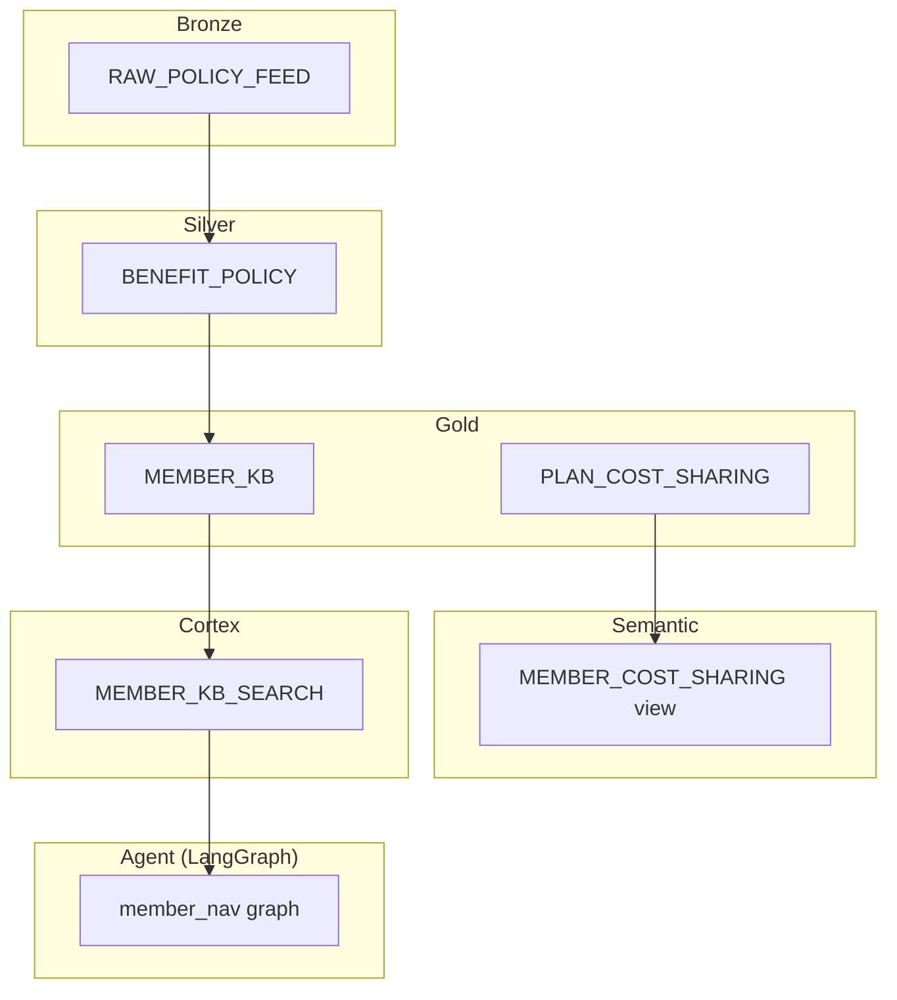

# Agentic AI Engineering Primer

Portfolio mapping for **Snowflake-based semantic data assets** and **agent-driven
analytics** — aligned with agentic AI engineering roles in health plans (e.g.
Cambia Health). All member data in this repo is **synthetic**; no real PHI.

## Role requirements ↔ repository artifacts

| Requirement | Artifact | Status |
|-------------|----------|--------|
| Snowflake semantic data assets for NL Q&A and AI insights | `AI.GOLD.MEMBER_KB` + `MEMBER_KB_SEARCH` Cortex service | Implemented |
| Medallion bronze / silver / gold layers | `snowflake/01_bronze.sql` → `03_gold.sql` | Implemented (DDL + lineage comments) |
| Semantic views and business abstractions | `snowflake/04_semantic_views.sql` (`MEMBER_COST_SHARING`, `V_MEMBER_COPAY`) | Implemented |
| Reusable data products from cross-team requirements | `data/knowledge_base.json`, `data/eval_set.json` (product/analytics ground truth) | Implemented |
| Operationalize Snowflake Cortex for agent workloads | `CortexRetriever` in `src/member_nav/knowledge.py`, `snowflake/05_cortex_search.sql` | Implemented |
| Data quality validation | `src/member_nav/mlops/evaluation.py` (recall@k, accuracy, promotion gate) | Implemented |
| Performance tuning | `src/member_nav/mlops/tuning.py` (Optuna TPE over `RagConfig`) | Implemented |
| Lineage-aware transformations | Bronze → silver → gold `lineage_sk` / `ingest_batch_id`; MLflow trial lineage | Implemented |
| Governed access patterns | `snowflake/06_governance.sql` (roles, masking, row access policies) | Implemented (illustrative) |
| Agentic workloads at scale | LangGraph cyclic graph, bounded loops, SqliteSaver checkpointing, PSI drift | Implemented |

## Architecture



## Data lineage

| From | To | Transform |
|------|-----|-----------|
| Source JSON / feeds | `AI.BRONZE.RAW_POLICY_FEED` | Append-only ingest with `file_hash` dedupe key |
| Bronze | `AI.SILVER.BENEFIT_POLICY` | Trim, category normalize, latest-wins dedupe |
| Silver | `AI.GOLD.MEMBER_KB` | Curated agent-ready documents with `lineage_sk` |
| Silver structured | `AI.GOLD.PLAN_COST_SHARING` | Plan cost-sharing reference rows |
| Gold KB | `AI.MEMBER_NAV.MEMBER_KB_SEARCH` | Cortex Search indexing + hybrid retrieval |
| Gold structured | `AI.SEMANTIC.*` | Business-friendly semantic and SQL views |

## Agent layer

The `member_nav` package implements **agentic RAG** — not a linear chain:

1. **Retrieve** from `Retriever` (TF-IDF offline, Cortex Search production)
2. **Grade retrieval** → rewrite query if weak (bounded loop)
3. **Generate** grounded answer
4. **Grade answer** → regenerate if ungrounded (bounded loop)

Hyperparameters (`top_k`, relevance threshold, loop budgets, prompt version) are
tuned by Optuna, tracked in MLflow, and promoted through a quality gate.

## MLOps lifecycle

| Stage | Component | Purpose |
|-------|-----------|---------|
| Search | `SEARCH_SPACE` + Optuna TPE | Find optimal `RagConfig` |
| Track | MLflow (`member-nav-rag` experiment) | Audit params and metrics per trial |
| Gate | `passes_gate()` | Floors: recall ≥ 0.75, accuracy ≥ 0.50; beat incumbent |
| Register | `ConfigRegistry` | Versioned Staging → Production promotion |
| Monitor | PSI on retrieval top-scores | Flag distribution drift without code changes |

## Governance model

`snowflake/06_governance.sql` defines:

- **`MEMBER_NAV_AGENT_ROLE`** — read `MEMBER_KB`, use Cortex Search warehouse
- **`MEMBER_NAV_ANALYST_ROLE`** — read semantic views and structured gold
- **Masking policy** on bronze `member_id_hash`
- **Row access policy** on gold `MEMBER_KB` (`is_active = TRUE`)

## Truthful resume language

> Portfolio: Snowflake medallion pipeline (bronze/silver/gold) feeding a Cortex
> Search semantic asset and semantic views over plan cost-sharing; LangGraph
> agentic RAG member navigator with MLflow tracking, Optuna HPO, promotion
> gates, and PSI drift monitoring. Synthetic health-plan data only.

## Local development (no Snowflake required)

```bash
pip install -e ".[dev]"
pytest -q
python scripts/demo.py
python scripts/run_sweep.py 20
```

## Production Snowflake path

Deploy `snowflake/*.sql` in order, load `data/knowledge_base.json` into bronze,
refresh silver/gold, then:

```python
from snowflake.snowpark import Session
from member_nav import CortexRetriever, build_graph, RagConfig

session = Session.builder.configs(conn_params).create()
retriever = CortexRetriever(session, service_name="MEMBER_KB_SEARCH")
app = build_graph(RagConfig(), retriever)
```

## Related docs

- [README](../README.md) — quickstart and technical deep dive
- [snowflake/README.md](../snowflake/README.md) — DDL deploy order and load examples
